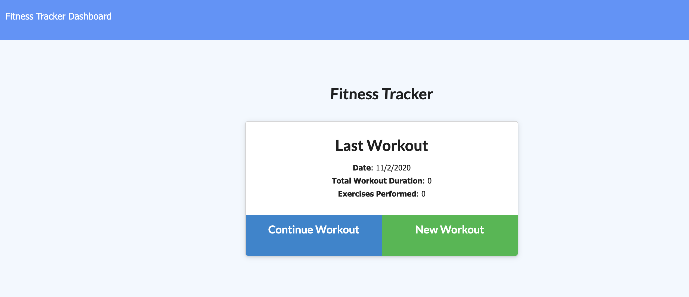
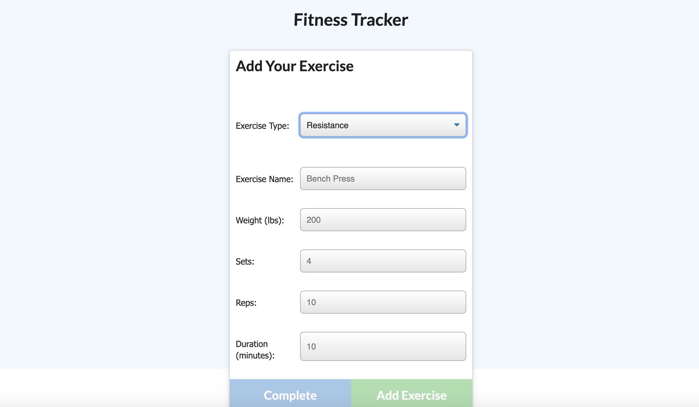
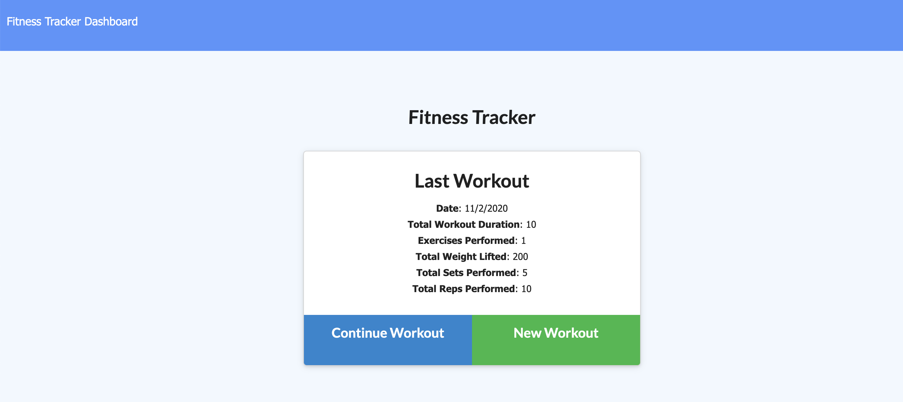
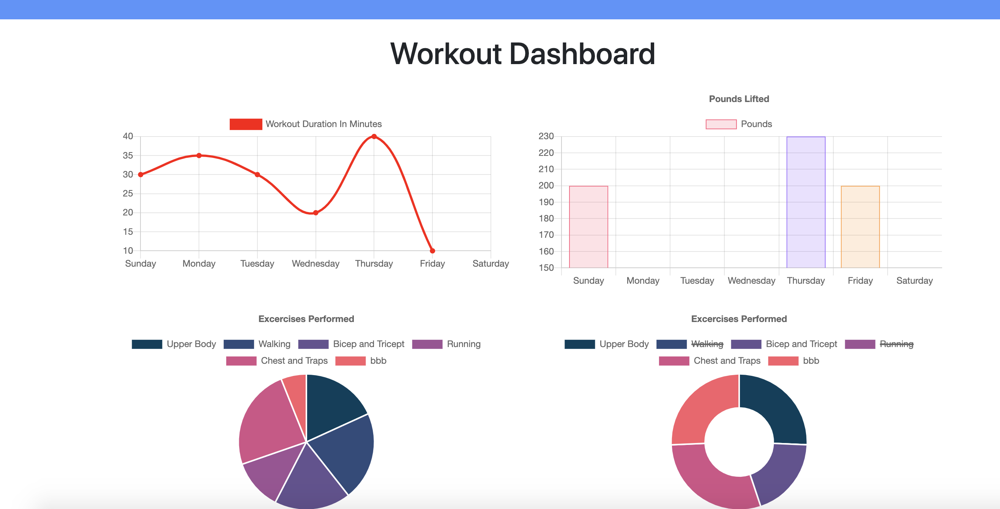

# Workout-Tracker

## Description
   Workout-Tracker is an app developed for tracking the daily workout activities of a user. This project includes the front end `public files`, the `server files` for routing and conections, and the `mongoDB nnSQL datatabase` for storing users records.
   ## Table of Contents
   * [Installation Instructions](#installation-instructions)
   
   * [Usage Instructions](#usage-instructions)
   
   * [Contribution](#Contribution)
   
   * [Developers Contact Information](#Developers-Contact-Information)
     
  * [License](#license)

   ## Installation Instructions
  You can use this app for trucking weekly and daily sport activities in [Workout-Tracker](https://dry-falls-25683.herokuapp.com/) based on [usage instructions](#usage-instructions). Moreover, the developer is authorizing a free usage and installation by cloning from the code [Bbeyenene/Workout-Tracker](https://github.com/Bbeyenene/Workout-Tracker).
   ## Usage Instructions
   1. Select new workout or continue workout to register an activities. 
      

   2. Then, select either cardio or resistance training you want to register.
      
      

   3. All your activities are in the [dashboard](https://dry-falls-25683.herokuapp.com/stats) in cahrt forms. You can track your excercise time in the line chart and wieght ecercise on the bar chart. Besides, you can erase the completed acticity from the list and it will be removed from the donnat chart at the bottom.
   

   ## Contribution
   [Bbeyenene](https://github.com/Bbeyenene) is the only contrubuter to this project.
   
   ## Developers Contact Information
   * LinkdIn Profile: [Berhane](https://www.linkedin.com/in/berhane-beyene/)
   * URL : [Workout-Tracker](https://dry-falls-25683.herokuapp.com/) 
   * Email: monoxica2004@yahoo.com
   ## License
   This application is licensed under .
